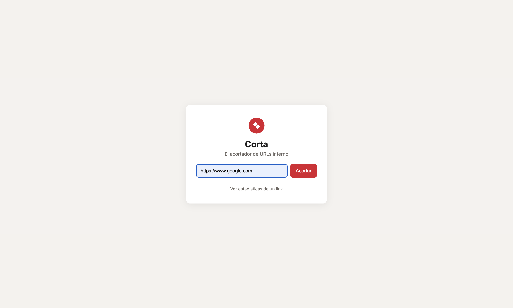
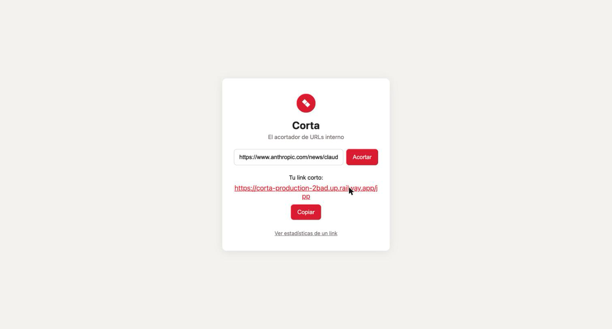
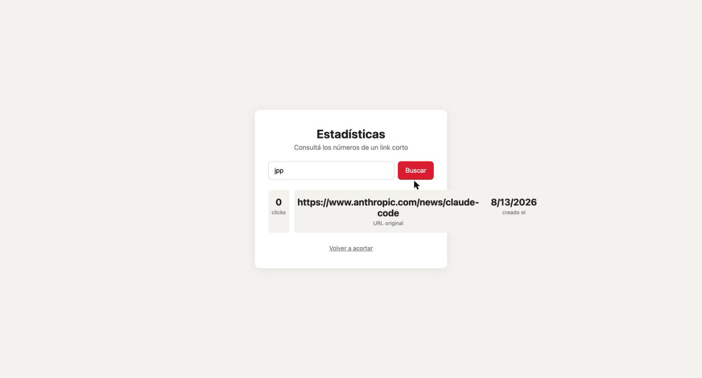

# Corta

Corta es el acortador de URLs interno de la empresa. Un empleado pega una URL larga, recibe un código corto de 3 caracteres, y ese código lo redirige al destino original. Cada link lleva la cuenta de cuántas veces se usó.

<p align="center">
  
</p>

**En producción:** https://corta-production-2bad.up.railway.app

## De dónde viene este proyecto

El desarrollador original de Corta se fue de la empresa sin dejar documentación. Lo único que entregó fue una carpeta de código: archivos duplicados, versiones viejas dando vueltas, dependencias sin usar, una nota con una credencial en texto plano, y una app que "más o menos andaba" pero con errores conocidos por los usuarios (el link corto no redirigía de verdad, los clicks no se guardaban, dos links podían terminar compartiendo el mismo código y pisarse) y una funcionalidad a medio terminar (la página de estadísticas).

Este repo documenta ese proceso completo: desde el desorden inicial (primer commit) hasta una versión en producción, con [`SPEC.md`](./SPEC.md) escrito a partir de lo que se fue descubriendo del comportamiento esperado, y una batería de tests que corre en rojo antes de cada fix y en verde después.

## Cómo usarlo

### Acortar un link

Pegás una URL, apretás "Acortar", y te devuelve un link corto para compartir.

<p align="center">
  
</p>

### Ver estadísticas

Desde la página principal, "Ver estadísticas de un link" lleva a una pantalla donde, poniendo el código de 3 caracteres, se consultan sus clicks, la URL de destino y la fecha de creación.

<p align="center">
  
</p>

## Cómo correrlo

```bash
npm install
npm start
```

El server queda escuchando en `http://localhost:3000`.

## Cómo correr los tests

```bash
npm test
```

Corre la batería de tests (`node --test`) contra una base de datos temporal y aislada — no toca `links.json`.

## Arquitectura

- **Server**: Express (`server.js`). Un único proceso, sin capas ni framework extra.
- **Storage**: `storage.js` usa Postgres cuando hay `DATABASE_URL` seteada (producción); si no, cae a `links.json` en la raíz del repo, leído y escrito entero en cada request (local y tests). Así los links y clicks sobreviven a un redeploy en producción sin necesitar una base real para desarrollar.
- **Frontend**: HTML/CSS/JS plano en `public/`, servido como estático por Express. Sin build step ni framework.
- **Generación de códigos**: `utils.js` arma códigos de 3 caracteres `[a-z0-9]` y reintenta hasta encontrar uno que no esté en uso, para que dos links nunca puedan pisarse.

### Endpoints

| Método | Ruta | Qué hace |
|---|---|---|
| `POST` | `/api/links` | Crea un link corto a partir de `{ url }`. Valida que sea una URL http(s) válida. |
| `GET` | `/:codigo` | Redirige (302) al destino del código, e incrementa su contador de clicks. |
| `GET` | `/api/links/:codigo/stats` | Devuelve `{ codigo, url, clicks, creado }` de un link, sin modificarlo. |

El comportamiento esperado de cada endpoint, con sus casos borde, está detallado en [`SPEC.md`](./SPEC.md).

## Limitaciones conocidas

- **`links.json` sin locking**: en el modo local/tests (sin `DATABASE_URL`), el archivo se lee y escribe entero por request sin locking — dos escrituras concurrentes pueden pisarse entre sí. En producción esto no aplica porque se usa Postgres.
- **Alfabeto de 3 caracteres**: 46.656 combinaciones posibles. Si el volumen de links crece mucho, va a hacer falta ampliar el código.

## Tests

El proyecto sigue TDD: los tests en `tests/` se derivan de `SPEC.md` y se escriben antes de cada corrección. Cubren validación de `url`, el redirect real, la persistencia de clicks, la resolución de colisiones de código, y el endpoint de estadísticas.
